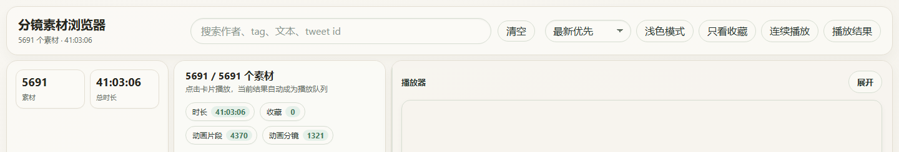

# TStoryboard Video Library

[中文说明](README.md) · [Live validation site](https://bytedance.aiforce.cloud/app/app_4kbvt59uxdxaq/)

[](https://bytedance.aiforce.cloud/app/app_4kbvt59uxdxaq/)

TStoryboard is a static browser frontend and small Python toolkit for browsing, filtering, and tagging a user-supplied X/Twitter video reference library.

This repository contains only the frontend template and local processing tools. It does not publish media files, downloaded metadata, creator lists, generated indexes, accepted tagging results, private settings, credentials, or deployment scripts.

## Live Validation

- Public entry: [https://bytedance.aiforce.cloud/app/app_4kbvt59uxdxaq/](https://bytedance.aiforce.cloud/app/app_4kbvt59uxdxaq/)
- The site is provided to validate the current frontend experience; its live data is not shipped with this repository.
- If you fork or reuse this project, use media and index data that you have the rights to process.

## Features

- `index.html`: static browser UI that reads `library/videos.index.json`.
- `tools/serve_video_library.py`: local preview server with HTTP Range support and a manual-edit API.
- `tools/build_video_library.py`: builds an index, thumbnails, and contact sheets from local videos.
- `tools/build_storyboard_tag_batches.py`: builds storyboard semantic tagging batches.
- `tools/merge_tag_batches.py`: merges thumbnail category/tag JSONL.
- `tools/merge_storyboard_tag_batches.py`: merges storyboard semantic tag JSONL.
- `docs/storyboard-semantic-tagging-rules.md`: storyboard tagging rules.

## Data Boundary

This repository is not a dataset and does not contain a publishable media library. Do not commit:

- User media, thumbnails, contact sheets, or downloaded metadata.
- Creator/source lists, account cookies, credentials, or private settings.
- Generated indexes, manual edits, or accepted tagging results.
- Private deployment, sync, upload, or publishing workflows.

You can generate and use those files locally, but review your rights before sharing any derived data.

## Requirements

- Python 3.
- Python dependencies from `requirements.txt`.
- `ffmpeg` / `ffprobe` on `PATH` if you need thumbnail generation or video probing.
- A modern browser.

Install dependencies:

```bash
python -m pip install -r requirements.txt
```

## Quick Start

Put videos you are allowed to process under a local media directory such as `Downloads/`, then build a local index:

```bash
python tools/build_video_library.py --downloads Downloads --library library
```

For a quick smoke test, skip thumbnails and contact sheets:

```bash
python tools/build_video_library.py --downloads Downloads --library library --skip-thumbnails --skip-contact-sheets
```

Start the local preview server:

```bash
python tools/serve_video_library.py --port 8765
```

Open `http://127.0.0.1:8765/index.html`. The frontend reads `library/videos.index.json` from the project root.

## Supplying Your Own Index

If you already have an index builder, write compatible data to `library/videos.index.json`. When using the included preview server, paths such as `video_path`, `thumb_path`, and `metadata_path` should be relative to the project root.

Minimal shape:

```json
{
  "schema_version": 1,
  "generated_at": "2026-01-01T00:00:00",
  "records": [
    {
      "id": "example/demo",
      "author": "example",
      "tweet_text": "",
      "video_path": "Downloads/example/demo.mp4",
      "thumb_path": "Downloads/example/demo.thumb.jpg",
      "metadata_path": null,
      "curated": {
        "category": "animation",
        "tags": ["reference"]
      }
    }
  ],
  "batches": [],
  "summary": {}
}
```

The UI can display richer records when fields such as `tweet_url`, `created_at`, `duration`, `width`, `height`, `source_tags`, and storyboard tags are present, but those fields are optional for a basic local preview.

## Tagging And Build Tools

Build storyboard tagging batches from the visible index:

```bash
python tools/build_storyboard_tag_batches.py --index library/videos.index.json --output library/storyboard_tagging --limit 20
```

Merge thumbnail classification JSONL:

```bash
python tools/merge_tag_batches.py --library library --input-glob "library/tagging/agent_batches/*.jsonl"
```

Merge storyboard semantic tags:

```bash
python tools/merge_storyboard_tag_batches.py --library library --index library/videos.index.json --input-glob "library/storyboard_tagging/agent_batches/*.jsonl"
```

Generated indexes, thumbnails, contact sheets, manual edits, and accepted tag files are local working data. Review them before sharing.

## Privacy And Copyright

Only process media you have permission to store, inspect, and transform. Do not publish private videos, creator lists, personal data, cookies, credentials, or generated indexes that reveal private collections. Respect the rights and terms that apply to the original media sources.
