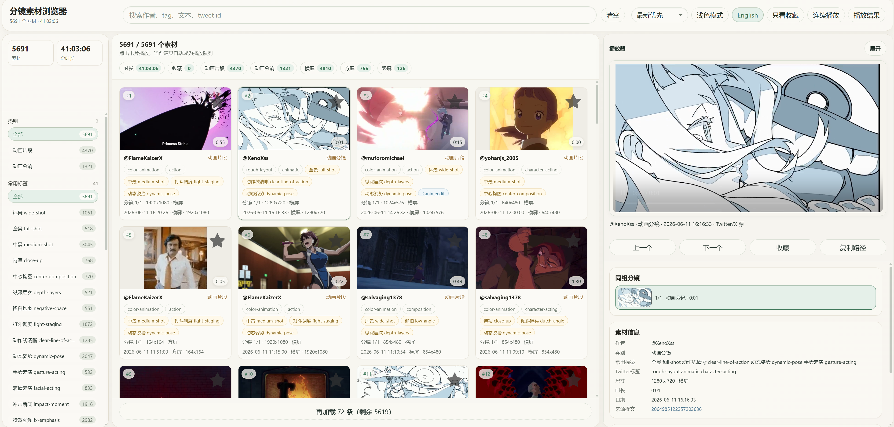

# TStoryboard 视频素材浏览器

[English README](README.en.md) · [在线验证入口](https://bytedance.aiforce.cloud/app/app_4kbvt59uxdxaq/)

当前仓库是围绕 Twitter/X 平台构建视频合集、tag 打标、个人知识库的流程文档。案例为分镜合集，链接如下：

[](https://bytedance.aiforce.cloud/app/app_4kbvt59uxdxaq/)

TStoryboard 是一个静态浏览器前端和小型 Python 工具集，用于浏览、筛选和打标用户自备的 X/Twitter 视频参考素材库。

这个仓库只提供前端模板和本地处理工具。媒体文件、下载元数据、创作者清单、生成后的索引、已验收的打标结果、私有配置、凭据和部署脚本都不属于公开仓库内容。

## 在线验证

- 公开入口：[https://bytedance.aiforce.cloud/app/app_4kbvt59uxdxaq/](https://bytedance.aiforce.cloud/app/app_4kbvt59uxdxaq/)
- 访问线上案例和原始 Twitter/X 来源可能需要科学上网。
- 该入口用于验证当前前端效果；线上展示数据不随本仓库发布。
- 如果你 fork 或复用本项目，请使用你自己有权处理的素材和索引数据。

## 功能

- `index.html`：静态浏览器界面，读取本地 `library/videos.index.json`。
- `tools/serve_video_library.py`：本地预览服务，支持视频 Range 请求和手动编辑 API。
- `tools/build_video_library.py`：从本地视频生成索引、缩略图和 contact sheet。
- `tools/build_storyboard_tag_batches.py`：生成分镜语义打标批次。
- `tools/merge_tag_batches.py`：合并缩略图分类/标签 JSONL。
- `tools/merge_storyboard_tag_batches.py`：合并分镜语义标签 JSONL。
- `docs/storyboard-semantic-tagging-rules.md`：分镜语义标签规则。

## 数据边界

本仓库不是数据集，也不包含任何可直接发布的素材库内容。请不要把以下内容提交到公开仓库：

- 用户媒体、缩略图、contact sheet 或下载元数据。
- 创作者/source 列表、账号 cookie、凭据或私有配置。
- 生成后的索引、人工编辑结果、已验收打标结果。
- 私有部署、同步、上传或发布流程。

你可以在本地生成和使用这些数据，但分享前需要确认自己有处理和发布相关内容的权利。

## 环境要求

- Python 3。
- `requirements.txt` 中的 Python 依赖。
- 如需生成缩略图或探测视频信息，需要在 `PATH` 中安装 `ffmpeg` / `ffprobe`。
- 一个现代浏览器。

安装依赖：

```bash
python -m pip install -r requirements.txt
```

## 快速开始

把你有权处理的视频放到本地媒体目录，例如 `Downloads/`，然后生成本地索引：

```bash
python tools/build_video_library.py --downloads Downloads --library library
```

只做快速冒烟测试时，可以跳过缩略图和 contact sheet：

```bash
python tools/build_video_library.py --downloads Downloads --library library --skip-thumbnails --skip-contact-sheets
```

启动本地预览服务：

```bash
python tools/serve_video_library.py --port 8765
```

打开 `http://127.0.0.1:8765/index.html`。前端会从项目根目录读取 `library/videos.index.json`。

## 使用自定义索引

如果你已经有自己的索引生成流程，只需要写出兼容的 `library/videos.index.json`。使用内置预览服务时，`video_path`、`thumb_path`、`metadata_path` 建议使用相对项目根目录的路径。

最小示例：

```json
{
  "schema_version": 1,
  "generated_at": "2026-01-01T00:00:00",
  "records": [
    {
      "id": "example/demo",
      "author": "example",
      "tweet_text": "",
      "video_path": "Downloads/example/demo.mp4",
      "thumb_path": "Downloads/example/demo.thumb.jpg",
      "metadata_path": null,
      "curated": {
        "category": "animation",
        "tags": ["reference"]
      }
    }
  ],
  "batches": [],
  "summary": {}
}
```

如果记录中包含 `tweet_url`、`created_at`、`duration`、`width`、`height`、`source_tags` 或分镜语义标签，界面会展示更多信息；这些字段对基础预览不是必需的。

## 打标与构建工具

从可见索引生成分镜打标批次：

```bash
python tools/build_storyboard_tag_batches.py --index library/videos.index.json --output library/storyboard_tagging --limit 20
```

合并缩略图分类 JSONL：

```bash
python tools/merge_tag_batches.py --library library --input-glob "library/tagging/agent_batches/*.jsonl"
```

合并分镜语义标签：

```bash
python tools/merge_storyboard_tag_batches.py --library library --index library/videos.index.json --input-glob "library/storyboard_tagging/agent_batches/*.jsonl"
```

生成的索引、缩略图、contact sheet、手动编辑和已验收标签都是本地工作数据，分享前请先审查。

## 隐私与版权

只处理你有权保存、检查和转换的媒体。不要公开私有视频、创作者列表、个人信息、cookie、凭据，或会暴露私人收藏的生成索引。请遵守原始媒体来源适用的权利和服务条款。
